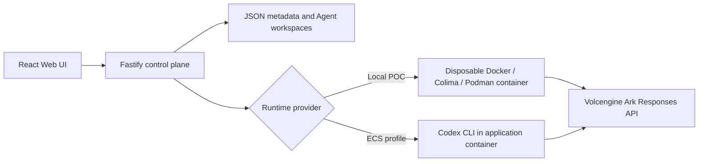

# Volc Agent Launchpad

A minimal Agent platform for three-day middleware hackathons. It provides Agent
CRUD, a browser Playground, persistent workspaces, and Codex CLI backed by the
Volcengine Ark Responses API.

Run it locally with Docker, Colima, or rootless Podman, or deploy it to
Volcengine ECS.

> [!WARNING]
> This is a single-user proof of concept. It intentionally has no identity,
> tracing, audit, or hardened sandbox middleware. Do not use production data or
> credentials. See [SECURITY.md](SECURITY.md).

## Screenshots

### Agent Playground


### Create an Agent


## Features

- React and TypeScript Web UI
- Agent create, edit, start, stop, delete, and multi-turn chat
- Fastify control plane with asynchronous Run state
- Persistent Agent workspaces and Codex sessions
- Disposable Docker, Colima, or Podman container for each local turn
- Docker and Terraform deployment paths for Volcengine ECS

## Sessions

A Session is one durable conversation shared by up to ten Agents. You send a
prompt; the middleware decides who answers, in what order, and whether their
output is acceptable; the transcript persists across prompts and across
restarts.

The point is that **the middleware provides the reliability, not the models**.
Agents return malformed JSON, time out, and contradict each other. Every
guarantee below is enforced by backend code that treats model output as
untrusted input.

### What it does

- **Multi-prompt sessions.** A session stays alive between prompts in an
  `awaiting_input` state, and survives a server restart.
- **Adaptive routing.** Auto tries one primary candidate and expands to an
  auction when confidence, recommendation, or budget gates miss. Direct runs
  one ordinary turn; Auction gathers one private bid per eligible participant.
  The backend validates each embedded plan and records one immutable award.
- **Parallel waves.** Independent work fans out concurrently, capped by
  `maxParallelTurns`. One sibling failing never aborts the others.
- **Evidence.** Every turn, attempt, artifact, and decision is recorded with a
  reason — and with no prompts, no raw output, and no lease tokens.

### Using a session

1. Create Agents and wait for each to reach `ready`. Instructions to paste are
   in [docs/AGENT_TEMPLATES.md](docs/AGENT_TEMPLATES.md).
2. Create a session: give it a name and an objective, pick 2–10 participants,
   and leave routing on **Auto**.
3. Send a prompt. Watch the bid evidence, immutable award, then execution.
4. Send more prompts to the same session. The transcript carries forward.
5. **Stop** cancels the current wave and leaves the session recoverable. **End**
   finishes the session deliberately. They are different actions.

The API is documented in [docs/COORDINATION_API.md](docs/COORDINATION_API.md).

### Limitations

Stated plainly, because they are real:

- **Single process, single user.** No identity, tenancy, audit, or horizontal
  scaling. Two servers against one data directory will corrupt it.
- **Recovery uses durable evidence, not provider-process resurrection.** Idle
  sessions survive intact. In-flight attempts are cancelled/fenced; auction
  recovery re-derives from committed bids and awards without re-scoring a
  winner or treating cancelled execution as complete.
- **Transcript length is measured, not assumed.** The default and recommendation
  are **2,000 committed turns** (2.97s for the measured final prompt); the UI
  warns from 1,600. The explicit 100,000 ceiling remains available but is not a
  performance claim: 10,000 turns already took 18.05s for one measured prompt.
- **No streaming.** Progress is observed by polling every 1.5s.
- **Long sessions prompt against a recent window.** When the transcript exceeds
  the context budget, older entries are dropped first.
- **The middleware never judges quality.** “Winner” means highest-ranked valid
  bid under the recorded scoring version, not objectively best.
- **A wave is N concurrent model calls.** Ten participants can saturate a
  per-account provider rate limit far faster than single-Agent use.

## Requirements

- Node.js 22+
- npm 10+
- Docker, Colima, or Podman
- A Volcengine Ark API key and endpoint that supports the Responses API
- Terraform 1.x only when validating or using the optional Terraform deployment

Codex CLI is included in the Runtime image and is not required on the host.

## Local browser SOP

### 1. Check the local tools

Install Node.js 22+ and one supported container engine, then verify them:

```bash
node --version
npm --version
docker --version        # Docker Desktop, Docker Engine, or Colima
podman --version        # Use this instead when running Podman
```

Only one container engine is required. Codex CLI is already included in the
Runtime image.

### 2. Clone the repository

```bash
git clone https://github.com/LEE-wz/CodeJam.git volc-agent-launchpad
cd volc-agent-launchpad
```

Skip this step when already working from the repository root.

### 3. Start the POC

```bash
ARK_API_KEY=your-ark-api-key \
ARK_MODEL=ep-your-endpoint-id \
npm run poc
```

The first run installs Node.js dependencies and builds the Runtime image. The
script automatically selects Docker, Colima, or Podman.

### 4. Open the browser

Visit <http://localhost:3001>, or open it from the terminal:

```bash
open http://localhost:3001       # macOS
xdg-open http://localhost:3001   # Linux desktop
```

In the Web UI:

1. Select **Create Agent**.
2. Enter a name, description, and workspace instructions.
3. Select **Create Agent** again.
4. Enter a task in the Playground, for example:

   ```text
   Create a TypeScript hello-world CLI, add a test, and run it.
   ```

The Agent can write files, run commands, and continue the same Codex session in
later messages.

### 5. Stop and resume

Press `Ctrl+C` in the startup terminal. The script removes temporary Runtime
containers but keeps Agent workspaces and conversations.

- macOS state: `~/.volc-agent-launchpad/`
- Linux state: `.local/`
- Custom location: set `LOCAL_POC_DATA_ROOT`

Run the same `npm run poc` command to continue later.

### Select a specific container engine

Force Podman when multiple engines are installed:

```bash
CONTAINER_ENGINE=podman \
ARK_API_KEY=your-ark-api-key \
ARK_MODEL=ep-your-endpoint-id \
npm run poc
```

Colima uses `CONTAINER_ENGINE=docker` because it exposes the Docker CLI.

For a clean Linux host, follow the
[rootless Podman setup](docs/LOCAL_POC.md#rootless-podman-on-linux).

## Docker Compose

Create and edit the configuration:

```bash
./scripts/bootstrap-local.sh
```

Required values in `.env`:

```dotenv
ARK_API_KEY=your-ark-api-key
ARK_MODEL=ep-your-endpoint-id
APP_AUTH_TOKEN=replace-with-at-least-24-random-characters
```

Start the application:

```bash
docker compose up --build
```

Open <http://localhost:3001>. Stop it without deleting Agent data:

```bash
docker compose down
```

## Development

```bash
npm install
cp .env.example .env
npm install --global @openai/codex@0.111.0
npm run dev
```

- Web UI: <http://localhost:5173>
- API: <http://localhost:3001>

Use local paths in `.env` when running outside Docker:

```dotenv
APP_DATA_DIR=.data
AGENT_WORKSPACE_ROOT=workspaces
CODEX_HOME=codex-home
```

## Deployment

- [Existing Linux ECS with Docker](docs/DEPLOYMENT.md#existing-linux-ecs)
- [Complete Volcengine environment with Terraform](docs/DEPLOYMENT.md#terraform-deployment)
- [Local Docker, Colima, and Podman details](docs/LOCAL_POC.md)

The existing-ECS script deploys from the current source tree:

```bash
cp .env.example .env.production
./scripts/deploy-existing-ecs.sh .env.production
```

The Terraform path provisions VPC, subnet, security group, ECS, and EIP:

```bash
cp deploy/volcengine/terraform.tfvars.example \
  deploy/volcengine/terraform.tfvars
./scripts/deploy-volcengine.sh
```

## Configuration

| Variable | Default | Purpose |
| --- | --- | --- |
| `ARK_API_KEY` | Required | Ark model API key. |
| `ARK_MODEL` | Required | Responses-capable endpoint or model ID. |
| `ARK_BASE_URL` | Beijing v3 endpoint | Ark OpenAI-compatible API URL. |
| `APP_AUTH_TOKEN` | Empty on loopback | Shared demo token; use 24+ random characters remotely. |
| `RUNTIME_PROVIDER` | `local-process` | `container` for disposable local Runtime containers. |
| `CODEX_SANDBOX_MODE` | `workspace-write` | Codex inner sandbox mode. |
| `CODEX_TIMEOUT_MS` | `600000` | Maximum duration of one turn. |
| `LOCAL_POC_DATA_ROOT` | Platform-specific | Local metadata, workspace, and session directory. |

See [.env.example](.env.example) for all Runtime and resource-limit options.

## How it works



The first turn uses `codex exec`; later turns resume the stored Codex thread.
Deleting an Agent archives its workspace under `workspaces/.deleted/`.

See [docs/ARCHITECTURE.md](docs/ARCHITECTURE.md) for component and extension
boundaries.

## Validation

```bash
npm run check
terraform fmt -check -recursive deploy/volcengine
docker compose config
```

## Documentation

**Session**

- [Session architecture](docs/COORDINATION_ARCHITECTURE.md)
- [Session protocol](docs/COORDINATION_PROTOCOL.md)
- [Session API](docs/COORDINATION_API.md)
- [Session operations](docs/COORDINATION_OPERATIONS.md)
- [Decisions](docs/DECISIONS.md)
- [Demo script](docs/DEMO.md)
- [Agent templates](docs/AGENT_TEMPLATES.md)

**Platform**

- [Architecture](docs/ARCHITECTURE.md)
- [Local POC](docs/LOCAL_POC.md)
- [Deployment](docs/DEPLOYMENT.md)
- [Hackathon extension guide](docs/HACKATHON_EXTENSION_GUIDE.md)
- [Security policy](SECURITY.md)
- [Contributing](CONTRIBUTING.md)

## License

[MIT](LICENSE)
