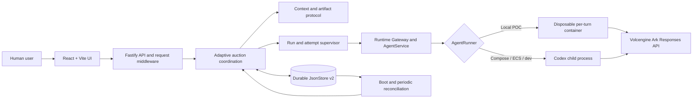
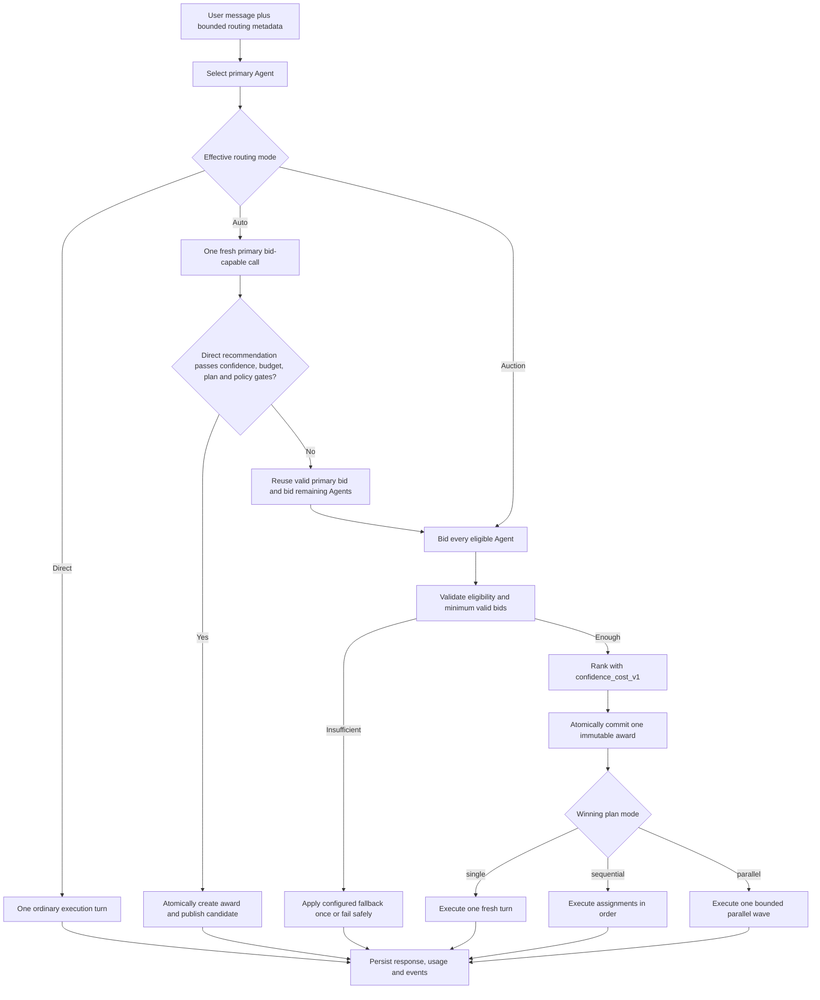

# Volc Agent Launchpad — Adaptive Auction Middleware

This branch adds an adaptive bidding and award layer to Volc Agent Launchpad.
For each message, the backend can route directly to one Agent, ask specialised
Agents for structured bids, or let one primary Agent recommend the least
expensive safe path. Valid bids are ranked with a deterministic, auditable
score; the awarded single-Agent or team plan is then executed through the
existing Codex/Volcengine Ark runtime.

**Branch:** `bidding-agent-implementation`

**Verified revision:** `a383389` (2026-09-01)

**Status:** Auction Checkpoint 14 complete

> [!WARNING]
> This is a single-user hackathon proof of concept, not a production or
> multi-tenant system. Use only scoped, revocable development credentials and
> non-sensitive data. See [Limitations](#limitations) and
> [SECURITY.md](SECURITY.md).

## Contents

- [Setup](#setup)
- [Middleware problem and rationale](#middleware-problem-and-rationale)
- [Design summary](#design-summary)
- [Automated tests](#automated-tests)
- [Demo](#demo)
- [Limitations](#limitations)

## Setup

### Requirements

- Node.js 22 or newer
- npm 10 or newer
- Docker, Colima, or Podman for the recommended local POC
- A Volcengine Ark API key
- An Ark endpoint/model ID that supports the OpenAI-compatible Responses API

Codex CLI is already pinned in the Runtime images; it is not required on the
host for the recommended POC or Docker Compose paths.

Confirm the branch and local tools:

```bash
git switch bidding-agent-implementation
node --version
npm --version
docker --version   # or: podman --version
```

### Recommended: local POC with a disposable Runtime per turn

This profile runs the React/Fastify control plane on the host and starts each
Agent turn in a disposable Docker, Colima, or Podman container. The script
detects an available engine, installs dependencies when needed, builds the
Runtime and application, and keeps Agent state between restarts.

Set credentials in the current shell without putting the API key in the command
history:

```bash
export ARK_MODEL='<responses-capable-endpoint-or-model-id>'
printf 'Ark API key: '
read -rs ARK_API_KEY
printf '\n'
export ARK_API_KEY
npm run poc
```

Open <http://localhost:3001>. Press `Ctrl+C` to stop the control plane and remove
that instance's remaining Runtime containers. Persistent state stays in:

- macOS: `~/.volc-agent-launchpad/`
- Linux: `.local/`
- Custom path: the directory named by `LOCAL_POC_DATA_ROOT`

When finished, remove the secret from the current shell:

```bash
unset ARK_API_KEY
```

Useful overrides:

```bash
CONTAINER_ENGINE=podman npm run poc
LOCAL_POC_DATA_ROOT=/path/to/disposable/state npm run poc
```

Colima exposes the Docker CLI, so use `CONTAINER_ENGINE=docker` with Colima.
For rootless Podman and restricted-network setup, see
[docs/LOCAL_POC.md](docs/LOCAL_POC.md).

### Alternative: Docker Compose

Compose runs the control plane and Codex in the application container. It is
convenient for the full live rehearsal, but it does **not** provide a separate
container boundary for each Agent.

```bash
./scripts/bootstrap-local.sh
```

Edit the generated, git-ignored `.env` locally and provide values for:

```dotenv
ARK_API_KEY=<scoped-development-key>
ARK_MODEL=<responses-capable-endpoint-or-model-id>
APP_AUTH_TOKEN=<unique-url-safe-token-of-at-least-24-characters>
```

Then start the application:

```bash
unset LAUNCHPAD_ENV_FILE
docker compose up --build
```

Open <http://localhost:3001> and enter the same shared demo token in the unlock
screen. Stop without deleting persistent state:

```bash
docker compose down
```

### Contributor development mode

Development mode runs Vite and Fastify on the host and therefore requires a
host Codex CLI. Keep `.env` local, and change the container paths from
`.env.example` to host paths before starting:

```bash
npm ci
cp .env.example .env
npm install --global @openai/codex@0.111.0
npm run dev
```

Use these host paths in `.env`:

```dotenv
APP_DATA_DIR=.data
AGENT_WORKSPACE_ROOT=workspaces
CODEX_HOME=codex-home
```

- Web UI: <http://localhost:5173>
- API: <http://localhost:3001>

### Configuration and secret handling

| Variable | Required/default | Purpose |
| --- | --- | --- |
| `ARK_API_KEY` | Required for real runs | Secret used by the server and active Runtime to call Ark. |
| `ARK_MODEL` | Required for real runs | Responses-compatible Ark endpoint or model ID. |
| `ARK_BASE_URL` | Beijing Ark v3 endpoint | OpenAI-compatible Responses API base URL. |
| `APP_AUTH_TOKEN` | Optional on loopback; required for non-loopback production | Shared demo bearer token, not user identity or RBAC. |
| `RUNTIME_PROVIDER` | `local-process` | Use `container` for disposable local Runtime containers. |
| `CODEX_SANDBOX_MODE` | `workspace-write` | Inner Codex sandbox request. |
| `CODEX_TIMEOUT_MS` | `600000` | Ordinary Agent turn timeout; session policy applies its own bounded attempt timeout. |
| `COORDINATION_RECONCILE_INTERVAL_MS` | `60000` | Interval for repairing orphaned non-terminal coordination work. |
| `CONTAINER_CPU_LIMIT` | `2` | CPU limit for local per-turn containers. |
| `CONTAINER_MEMORY_LIMIT` | `2g` | Memory limit for local per-turn containers. |
| `CONTAINER_PIDS_LIMIT` | `256` | Process limit for local per-turn containers. |

Never commit `.env`, `.env.production`, Terraform state, `codex-home/`, Agent
workspaces, logs, or generated data. These paths are already ignored. Do not
paste their contents into issues, test fixtures, demo recordings, or this
README. Terraform POC state can contain the Ark key and must be handled as a
secret.

## Middleware problem and rationale

### The problem

A single fixed Agent is inexpensive but may be a poor fit for work outside its
speciality. Sending every prompt to every Agent provides more perspectives but
adds latency and model usage even for simple questions. A purely UI-driven
selector is also too weak: a client or model could widen budgets, fan-out, or
participant scope, and a process crash could leave ambiguous or duplicated
work.

The middleware therefore has to answer four questions for every message:

1. Is one direct call enough, or is competition justified?
2. Which plans are mechanically valid under the session's fixed limits?
3. How can one valid plan be selected reproducibly without claiming to know
   which answer is semantically “best”?
4. How can the selection and execution survive retries, cancellation,
   concurrency, and server restart without duplicate awards or hidden work?

### Why an adaptive auction

The branch uses three backend-owned routing modes:

| Mode | Behaviour | Best fit |
| --- | --- | --- |
| **Direct** | Select one available Agent deterministically and run one ordinary turn. No bid wave is allowed unless direct-failure escalation was explicitly enabled in session policy. | Simple work or an operator-selected specialist. |
| **Auction** | Give every eligible participant one bid opportunity, validate all settled bids, rank the valid set, commit one award, and execute its plan. | High-risk, ambiguous, or cross-specialist work. |
| **Auto** | Ask one primary Agent for a bid-capable response. Publish its direct candidate in one call only if every gate passes; otherwise reuse it as the primary bid and expand to the remaining participants. | Default path that avoids paying a multi-Agent tax for simple work without wasting the first call when escalation is needed. |

This is middleware rather than prompt convention: request schemas, budgets,
participant membership, bid parsing, scoring, scheduling, award creation, and
recovery are enforced in the Fastify/backend path. Agent output cannot change
the scoring version, increase concurrency, add participants, or raise a budget.

The score deliberately means **highest-ranked valid bid under
`confidence_cost_v1`**, not “best Agent.” The backend validates declared
evidence and execution shape; it does not semantically judge plan quality.

## Design summary

The detailed one-page diagram is available as
[SVG](docs/architecture-bidding-agent-implementation.svg) or
[PNG](docs/architecture-bidding-agent-implementation.png).


### Components and trust boundaries



- **React UI:** creates and specialises Agents, creates two-to-ten participant
  sessions, selects Auto/Direct/Auction, applies per-message routing overrides,
  and displays transcript, awards, token accounting, bid evidence, attempts,
  and events.
- **Fastify API middleware:** applies the optional timing-safe bearer-token
  check, CORS policy, a 1 MiB body limit, strict Zod schemas, bounded error
  envelopes, and authorization/cookie log redaction.
- **Coordination service:** derives the next action from durable state and owns
  routing, bounded waves, retries, cancellation, fallback, and recovery.
- **Context and artifact protocol:** builds bounded role-scoped prompts, parses
  strict JSON artifacts, validates cross-field constraints, and prevents losing
  bids or rejected raw output from entering the chat transcript.
- **Repository and JsonStore:** serialize mutations, atomically replace the
  state document, reserve Agents, fence attempts with opaque leases, keep a
  gapless event ledger, and commit one immutable award per user-message round.
- **Runtime gateway:** maps coordination turns to ordinary Agent runs, preserves
  cancellation and usage, and uses fresh threads for bids and awarded execution
  where hidden Agent conversation must not affect the result.
- **Recovery controller:** interrupts or reconciles orphaned work at boot and on
  a periodic sweep, ignores stale completions, and resumes from committed bids
  or a committed award.

### Round lifecycle



### Primary selection

No model call is spent selecting the primary Agent. The deterministic order is:

1. Agent explicitly selected for the message;
2. Agent awarded the preceding round in the same session;
3. highest bounded token match against snapshotted specialisation focus areas;
4. session default Agent;
5. stored participant order, then Agent ID for a stable tie.

Unavailable candidates are skipped without changing the auditable preference
order. Specialisation matching is advisory routing, not proof of competence.

### Bid and award protocol

Each `session_bid` is bounded JSON containing a `direct` or `auction`
recommendation, optional direct candidate, single/sequential/parallel plan,
distinct participant assignments, confidence in integer basis points, risks,
assumptions, and estimated output tokens. Validation rejects malformed JSON,
unknown fields, foreign or duplicate Agents, non-contiguous positions, invalid
plan shapes, and budget or concurrency violations.

Eligible bids use integer-only `confidence_cost_v1` scoring:

```text
score =
  70% × calibrated confidence
  − 25% × normalized projected execution cost
  −  5% × reliability penalty
```

Cold-start confidence is penalised until enough feedback exists. Recent user
ratings can calibrate declared confidence, while recent execution failures and
severe output-token underestimates contribute a bounded reliability penalty.
Ties resolve by calibrated confidence, projected cost, stored participant
order, then Agent ID.

The award is a backend-authored, immutable `session_award` artifact. It records
the selected Agent, winning bid, outcome, scoring version and components, and
projected execution tokens. A version-checked repository mutation enforces at
most one award for a user-message round, including competing loops and restart.

### Execution, failure, and cost accounting

- A `single` plan schedules one awarded Agent.
- A `sequential` plan executes assignments by position; later Agents see
  earlier committed messages from that awarded round.
- A `parallel` plan is atomically scheduled and executed under a bounded
  semaphore. Default concurrency is `min(participant count, 4)` and the hard
  ceiling is 10.
- Invalid bid output retries on the same bid opportunity. An exhausted bidder
  is retired only for that round; other valid bids can still be awarded.
- Too few valid bids applies exactly one configured `default_agent`,
  `round_robin`, or `fail` fallback. Fallback execution still calls a real
  Agent; the backend never fabricates an answer.
- Awarded execution failure does not silently promote the runner-up. Doing so
  would make the result timing-dependent and could duplicate work.
- **Stop wave** cancels active work and returns a session to
  `awaiting_input`; **End session** is terminal.
- The read model keeps actual bidding tokens, projected awarded-execution
  tokens, and actual execution tokens separate. These are token counts, not a
  currency-cost estimate.

Only user messages and published responses appear in chat. Losing bids remain
in the evidence ledger, and internal leases, provider thread IDs, full prompts,
and raw rejected output are not returned by the coordination API.

## Automated tests

Install the lockfile-defined dependencies and run the complete gate:

```bash
npm ci
npm run check
```

`npm run check` performs, in order:

1. TypeScript typechecking for the server and web workspaces;
2. all Vitest server and web tests; and
3. production builds for the React application and Fastify server.

Current verification on `bidding-agent-implementation` at `a383389`:

| Check | Result |
| --- | --- |
| Server | 38 test files, 694 tests passed |
| Web | 5 test files, 66 tests passed |
| Total | 760 tests passed |
| Typecheck | Both workspaces passed |
| Production build | Web and server passed |

The same counts are recorded for the branch's clean disposable Docker Compose
checkpoint gate. Unit and integration tests use fakes and temporary stores; the
normal `npm run check` does not need an Ark key and does not make provider
calls.

Run the auction-focused backend suites:

```bash
npm run test -w @launchpad/server -- \
  src/coordination/auction-routing.test.ts \
  src/coordination/auction-scoring.test.ts \
  src/coordination/auction-routing-decisions.test.ts \
  src/coordination/auction-award.test.ts \
  src/coordination/auction-execution.test.ts \
  src/coordination/auction-restart-recovery.test.ts
```

Run the auction UI suite:

```bash
npm run test -w @launchpad/web -- src/SessionAuction.test.tsx
```

Important coverage includes:

- Direct, Auction, Auto acceptance, every Auto escalation gate, sticky
  follow-up ownership, specialisation ties, unavailable primaries, and strict
  per-message override validation;
- bid-schema bounds, malformed and adversarial JSON, forged provenance,
  participant/position rules, injected policy fields, and output limits;
- exact integer scoring, cold start, feedback calibration, reliability
  penalties, projected-cost normalization, stable ties, and minimum-valid-bid
  boundaries;
- atomic scheduling, concurrent awards, direct-publication collision,
  fallbacks, partial bidder failure, timeout, cancellation, and proof that a
  runner-up is never silently executed;
- restart before award, restart after award, stale-attempt fencing, duplicate
  message idempotency, and stored-history compatibility;
- fresh-thread isolation, bounded wave concurrency, separate token accounting,
  redaction, transcript exclusion of losing bids, UI controls, award evidence,
  and feedback.

The real-provider rehearsal in the next section complements these automated
tests; it is intentionally not part of the default test gate because it uses
live credentials, time, concurrency, and model tokens.

## Demo

### Short browser demo

1. Start the recommended local POC and open <http://localhost:3001>.
2. Create at least three Agents. Give each a distinct **Bidding perspective**,
   comma-separated **Focus areas**, and bounded **Bidding instructions**. For
   example, use security/abuse, payments/fraud, and accessibility/inclusion.
   Wait until every participant is `ready`.
3. Open **Sessions**, select **Create session**, enter a name and objective, add
   the Agents in the desired stable order, choose **Auto**, optionally select a
   default Agent, review the safety limits, and select **Create session**.
4. In the new session, send a simple self-contained message such as:

   ```text
   In one sentence, explain what rate limiting does.
   ```

   Auto uses one primary call. If its direct recommendation satisfies every
   confidence, budget, plan, and policy gate, the candidate is awarded and
   published without a bid wave. A cautious escalation is also a valid Auto
   result; the evidence explains which path was taken.
5. For the next message, select **Auction** and send:

   ```text
   Assess the launch risks for a student marketplace and propose the smallest justified execution plan.
   ```

   Observe **Collecting and evaluating bids**, then **Executing the awarded
   plan**. Inspect the Award card, score components, projected versus actual
   execution tokens, expandable bid evidence, attempt statuses, and gapless
   event timeline. Confirm that losing bids do not appear in the chat.
6. Demonstrate the enforcement boundary: mark a message **High-risk request**.
   The UI forces Auction, and the backend rejects a request that combines
   `riskLevel: high` with Direct. Per-message routing can narrow the choice but
   cannot increase budgets, attempts, concurrency, or participant scope.
7. During another Auction round, select **Stop wave**. Confirm that live calls
   settle as cancelled and the session returns to `awaiting_input`; then send a
   Direct confirmation to show the session remains usable.
8. Select accepted/rejected feedback on an Award. Feedback creates a bounded
   audit event for later calibration without modifying the immutable award or
   blocking the session.

### Full live-provider rehearsal

The checked-in harness creates or reuses ten specialised Agents and exercises
all critical success, partial-failure, cancellation, and restart paths. It
prints evidence-safe IDs, timing, state, and usage; it does not print
credentials, provider threads, prompts, or model output.

> [!CAUTION]
> This rehearsal makes many real provider calls and can take 30–45 minutes or
> longer under rate limits. The recorded checkpoint used 94 calls and millions
> of input tokens. Run it only when that time and usage are intentional.

Prepare a local, git-ignored `.env`, then start Compose:

```bash
./scripts/bootstrap-local.sh
# Fill the local .env without committing or sharing it.
unset LAUNCHPAD_ENV_FILE
docker compose up --build -d
curl -sS http://127.0.0.1:3001/api/health
```

Run the rehearsal from the repository root:

```bash
node scripts/pa14-27-rehearsal.mjs run
```

It verifies nine rounds in one durable session:

1. Auto Direct with exactly one call and atomic candidate publication;
2. explicit Auction with durable competing bids and one executing award;
3. high-risk Auto escalation across the roster;
4. an awarded three-Agent sequential countdown-shaped plan;
5. an awarded three-Agent parallel fan-out;
6. a deliberately busy bidder that is retired without preventing an award;
7. Stop during live work with durable cancellation;
8. Direct resume after Stop; and
9. an exact restart after all bids settle but before an award, proving one
   recovered award and exactly-once execution.

A successful run ends with `PA14-27 PASS`, reconciled usage totals, a gapless
event sequence, and no attempt left `running`. Reprint safe evidence later:

```bash
node scripts/pa14-27-rehearsal.mjs report <run-id>
```

End rehearsal-owned sessions while retaining the reusable Agents, then stop
Compose:

```bash
node scripts/pa14-27-rehearsal.mjs cleanup
docker compose down
```

The branch's recorded successful run is summarised in
[docs/development/STATUS.md](docs/development/STATUS.md), and the full contract
and acceptance criteria are in
[the Auction Phase 14 sheet](docs/development/phases/parallel/14-adaptive-auction-coordination.md).

## Limitations

### Selection and model behaviour

- The scorer ranks mechanically valid declared evidence; it does not prove
  correctness, truth, safety, or semantic plan quality. Confidence is primarily
  model self-report until enough user feedback exists.
- Auto's primary recommendation is still model output. Structured high-risk
  metadata or an explicit Auction is required when competition is mandatory;
  prompt-keyword matching is not a safety boundary.
- Specialisation focus-area matching is lexical and advisory. It does not
  establish expertise.
- Auction increases latency and token usage because participants bid before the
  winner executes. Provider rate limits can slow or partially retire a wave.
- Token accounting reports tokens only. It does not calculate provider currency
  cost.
- User feedback is a coarse `accepted`/`rejected` signal, not a semantic
  evaluator or full reward model.

### Storage and scale

- `JsonStore` is a single-process, single-node persistence layer. It serializes
  writes to one JSON document and is not a database or distributed scheduler.
- Sessions support two-to-ten participants. The default parallel cap is four,
  with a hard ceiling of ten.
- The browser exposes core routing, default-Agent, turn, and timeout controls.
  Advanced auction budgets, retry/fallback settings, and concurrency policy are
  API-level configuration.
- Restart recovery is durable on one shared filesystem; there is no replicated
  control plane, distributed lease service, or cross-node failover.
- The removed countdown engine remains readable only as historical stored data;
  new sessions use free chat and awarded sequential plans for ordered work.

### Security and operations

- The shared bearer token is not identity, authorization, RBAC, or tenant
  isolation. There is no CSRF protection.
- Local Runtime containers are ordinary containers, not hardened multi-tenant
  sandboxes. Compose/ECS uses a Codex child process inside the application
  container and has no per-Agent container boundary.
- If Linux Landlock is unavailable, the local startup path can fall back to
  `danger-full-access` **inside the outer disposable container**. This remains a
  POC boundary, not tenant isolation.
- Agent execution has broad outbound network access and permits prompt-triggered
  command and file operations inside its available workspace.
- The Ark key is available to the server and active Runtime. Terraform POC
  state can also contain it.
- A remote deployment needs HTTPS, restricted network CIDRs, a unique token,
  scoped/revocable credentials, stronger isolation, identity and authorization,
  production storage, audit/observability, and a formal threat model before it
  can handle sensitive data.

## Further documentation

- [Security policy](SECURITY.md)
- [Architecture](docs/ARCHITECTURE.md)
- [Local POC](docs/LOCAL_POC.md)
- [Deployment](docs/DEPLOYMENT.md)
- [Auction foundation](docs/development/phases/parallel/13-auction-foundation.md)
- [Adaptive auction contract](docs/development/phases/parallel/14-adaptive-auction-coordination.md)
- [Implementation status and verification evidence](docs/development/STATUS.md)

## License

[MIT](LICENSE)
