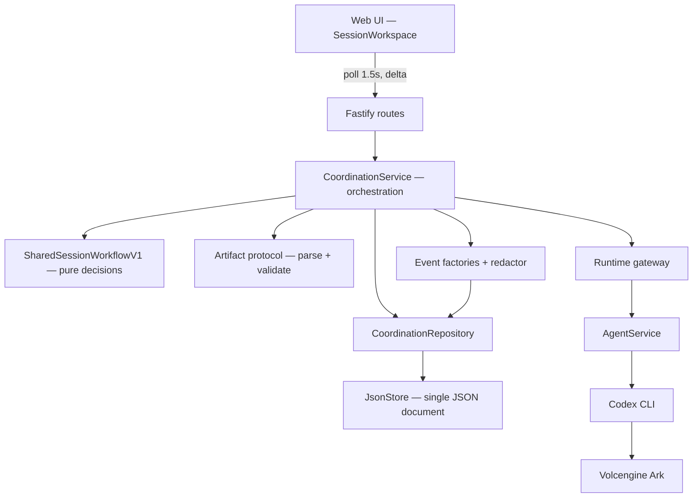

# Session Architecture

The components of the coordination layer, where the trust boundary sits, how a
session moves through its lifecycle, and how a wave of Agents is scheduled.

## 1. The claim this design makes

Reliability comes from the **middleware**, not from the models. Agents are
unreliable by assumption: they return malformed JSON, time out, contradict each
other, and occasionally propose nonsense. Every guarantee the product makes is
enforced by backend code that treats model output as untrusted input.

That is the whole architectural thesis, and everything below serves it.

## 2. Components



| Component | Responsibility | Never does |
|---|---|---|
| **Routes** | Validate request shape, map errors to HTTP | Decide workflow |
| **Service** | Orchestrate: schedule, execute, retry, settle, reconcile | Judge content |
| **Workflow** | Pure function from committed state → next decision | Perform I/O |
| **Protocol** | Parse and structurally validate artifacts | Judge quality |
| **Repository** | Atomic state transitions with optimistic versioning | Talk to models |
| **Gateway** | Invoke an Agent, return raw output | Interpret output |
| **Redactor** | Bound and allowlist event details | Pass content through |

The **workflow is a pure function**. It takes committed state and returns a
decision. It performs no I/O, which is why the entire routing matrix is testable
without a model — and why model output can never route itself (ADR-03).

## 3. The trust boundary

```
    UNTRUSTED                    │  TRUSTED
    ─────────────────────────────┼──────────────────────────────
    Model output                 │  Parsing and validation
    Artifact content             │  Scheduling and turn order
    A coordinator's plan         │  Leases and commits
    `done` signals               │  Limits and ceilings
    Bid/quality claims           │  Completion and termination
```

Everything on the left is *input*. Nothing on the left can change policy,
participants, limits, scheduling, or another run.

Three consequences worth stating explicitly:

- **An Agent never ends a session.** `done` is advisory. Termination is a user
  action, a failure, or a ceiling.
- **A coordinator Agent does not schedule.** It proposes a plan; the backend
  validates its *shape* and does the scheduling itself.
- **The middleware never judges substance.** A structurally valid plan that is
  strategically poor is accepted. Quality is not the middleware's job;
  determinism is.

## 4. Session lifecycle

```
created ──start──> running ──┬──> awaiting_input ──messages──> running
                             │           │
                             │           └──end──> completed
                             ├──stop──> stop_requested ──> stopped
                             └──> failed
```

`awaiting_input` is the state that makes a session long-lived rather than a
one-shot run: no active turn, no running loop, but **not terminal**. It accepts
another prompt, and it survives a restart.

A round ending returns the session to `awaiting_input`. It does **not** complete
it. A session becomes terminal only on:

- explicit **End** → `completed`
- **Stop** → `stopped`
- failure → `failed`
- the hard `maxTurns` ceiling → `failed` with `MAX_TURNS_EXCEEDED` (a ceiling is
  not a success)

## 5. How a round runs

1. A prompt arrives at `POST /:id/messages`. It is committed as a
   `user_message` artifact and the run moves to `running`.
2. The workflow is asked for a decision from committed state.
3. Under `sessionPlanning: "coordinator"` (default), a coordinator turn is
   scheduled first. It returns a `session_plan`, which is structurally
   validated. Under `round_robin`, membership is derived directly: the
   participants who have not yet answered the current user message.
4. The resulting wave is scheduled **atomically** — `scheduleTurns` writes the
   whole wave inside one `JsonStore.mutate()`. The optimistic version check is
   taken once for the whole wave, so siblings cannot invalidate each other and a
   partial wave is impossible.
5. One execution pipeline runs per turn, bounded by a semaphore at
   `maxParallelTurns` (default `min(participants, 4)`, ceiling 10). Each
   parallel turn is a live model call, so this is a resource control, not a
   formality.
6. Outcomes are collected with `Promise.allSettled`, then the run reloads and
   re-decides **once**. A sibling's failure never aborts its siblings.
7. When every assignment has committed, the run returns to `awaiting_input`.

### Per-turn settlement is independent

`activeTurnIds` is an array, not a pointer. `commitAcceptedArtifact` and
`finishAttempt` remove only their *own* turn from it; a commit no longer implies
the run has nothing in flight. A verified-handoff run always holds zero or one
entry, and a test asserts that invariant so the older workflow cannot
accidentally fan out.

## 6. Leases

Every attempt carries an opaque lease token. Only the holder of the **active**
lease may commit (ADR-09). A late result from a superseded attempt becomes a
`stale_ignored` event and changes nothing.

The lease token is internal. The public read model is
`Omit<CoordinationAttempt, "leaseToken">`, so it never reaches a client, and the
redactor's allowlist means it can never reach an event either.

This is what makes "a late or wrong-lease result cannot change current state" a
structural property rather than a hope.

## 7. Reservations

An Agent is **reserved** while it appears in a run whose status is `running` or
`stop_requested` (ADR-13). A reserved Agent cannot be used in the Playground,
edited, deleted, or started/stopped, and cannot join a second active run.

Reservation is **derived**, not stored — it is computed from run state, so it
cannot drift out of sync with reality.

The scope narrowed in P11-05: a session sitting in `awaiting_input` does not
reserve its participants. That is what makes long-lived sessions usable — a
session you are not actively prompting does not hold ten Agents hostage.

## 8. Persistence

One JSON document, written by `JsonStore`. Every mutation deep-clones the
database, serialises it, writes a temp file, and renames — which gives atomicity
per mutation and costs a whole-file write each time.

`CoordinationRepository` is the seam that makes the engine swappable. The
service, workflow, protocol, and routes sit above it and do not know which
implementation is underneath. An engine swap was measured, considered, and
**deferred** (`P15-04`): the quadratic that hurt was a data-model defect, not a
storage-engine defect.

See [Operations](COORDINATION_OPERATIONS.md) for measured cost and the hard
serialisation wall.

## 9. Restart and recovery

The server is a **single process**. On boot, runs that were `running` or
`stop_requested` are failed with `SERVER_RESTARTED` and are not auto-resumed —
an external model invocation cannot be safely reconstructed (ADR-12). Runs in
`awaiting_input` are left alive.

Separately, the reconciler answers every orchestration exit that did not make a
terminal repository call, classified as *already owned*, *resume*, or *already
correct*. Before Phase 11 six of those exits returned bare, stranding the run as
`running` with its participants reserved — the "stuck Agents" defect. That class
of bug is now closed by construction.

## 10. Related documents

- [Protocol](COORDINATION_PROTOCOL.md) — what Agents may say
- [API](COORDINATION_API.md) — routes and statuses
- [Operations](COORDINATION_OPERATIONS.md) — limits, storage, failure modes
- [Decisions](DECISIONS.md) — the reasoning, including rejected alternatives
