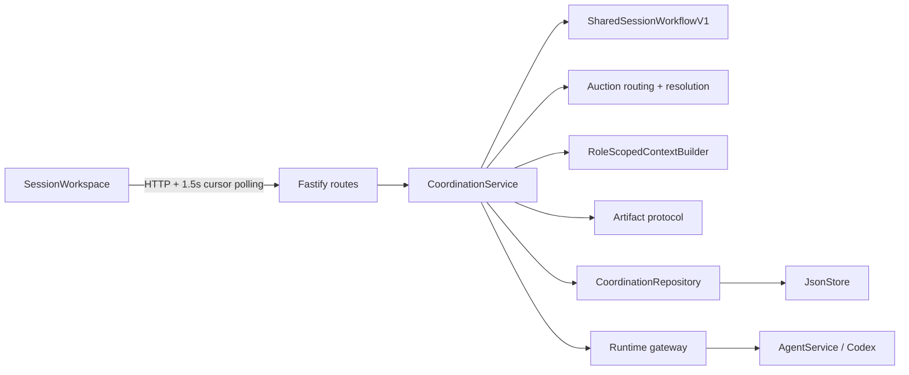

# Session Coordination Architecture

Session is a durable multi-prompt conversation for 2–10 Agents. The backend—not
the models—owns routing, budgets, concurrency, validation, leases, commits,
recovery, and the evidence ledger.

## Components



- Routes validate strict request shapes and map domain errors to HTTP.
- The service owns asynchronous loops, bounded waves, retry, cancellation, and
  reconciliation.
- The workflow is a pure function of committed state. It derives the same next
  action after a restart.
- Auction routing selects a primary, opens bid waves, scores with
  `confidence_cost_v1`, and records one immutable award per user-message round.
- The protocol parses JSON first, validates the expected artifact type and
  cross-field rules, then returns bounded feedback for a retry.
- The repository is the only coordination module that mutates durable state.
- The context builder exposes only the scoped transcript and, for winning
  execution, the winning award/plan. Losing bids are never prompt context.
- The runtime gateway invokes Agents. It cannot commit an artifact.

## Trust boundary

Model output is untrusted. An Agent may propose a bid, candidate answer, or
single/sequential/parallel plan, but it cannot:

- add participants or select an Agent outside the roster;
- widen token, attempt, turn, or concurrency budgets;
- create an award or change deterministic scoring;
- schedule work, acquire another turn's lease, or commit with a stale lease;
- end a session;
- place prompt content, raw rejected output, or lease tokens in public events.

The backend mechanically validates the bid schema and plan structure. It does
not semantically grade the answer. “Winner” means the highest-ranked valid bid
under the recorded scoring version, not objectively best.

## Session lifecycle

```
created --start/send--> running --round settled--> awaiting_input
                           |                         |
                           | stop active wave        | send prompt
                           v                         v
                     awaiting_input <----------- running
                           |
                           +--end--> completed

running --unrecoverable error/turn ceiling--> failed
```

`awaiting_input` is live but idle: it has no active turn and no loop owner,
survives restart, and accepts another prompt. Stop cancels the current work and
returns a Session v2 run to `awaiting_input`; End is the explicit terminal
action and is accepted only while idle. Stored legacy verified-handoff runs keep
their historical terminal stop behavior and render read-only in the current UI.

## One user-message round

1. `POST /api/coordination-runs/:id/messages` atomically appends a
   `user_message`, records its client id for duplicate suppression, and moves
   the run to `running`.
2. Direct schedules one normal execution turn. Auto schedules one primary bid
   and either publishes its candidate when all direct gates pass or expands to
   the remaining bidders. Auction schedules one bid opportunity per eligible
   participant.
3. Bid attempts run on fresh provider threads. Invalid output retries on the
   same turn; an exhausted bidder is excluded from this round only.
4. When bidding settles, deterministic scoring or the configured fallback
   creates one backend-authored `session_award`.
5. A direct candidate can be published atomically without a second model call.
   Otherwise the winning single, sequential, or parallel plan executes on fresh
   threads. Only the winning bid is referenced.
6. Once the awarded work commits, the run returns to `awaiting_input`.

A parallel wave is inserted by one `scheduleTurns` mutation. The supervisor
starts at most `maxParallelTurns` pipelines, waits for every sibling to settle,
then applies purpose-specific failure rules. One fast failure cannot strand a
slow sibling.

## Persistence and scale

The five coordination collections—runs, turns, attempts, artifacts, and
events—sit behind `CoordinationRepository` and currently live in the same v2
JSON document as Agent state. Each mutation clones and rewrites that document.

Phase 15 replaced per-turn transcript ID arrays with optional
`inputThroughSequence`. New session turns keep the active user message and
award explicit while pinning the ordinary transcript by sequence. Old turns
without a bound retain the legacy ID-list path. This preserves prompt scope and
auction round identity while changing ledger growth from quadratic to roughly
linear.

See [Operations](COORDINATION_OPERATIONS.md) for the measured 100–10,000-turn
cost and the storage decision.

## Agent reservations

A participant is reserved only while it has a running coordination attempt in a
non-terminal run. Merely belonging to a long-lived idle session does not reserve
it. Admission and runtime start both enforce the reservation boundary, so an
Agent cannot simultaneously accept overlapping coordination or Playground work.

## Recovery invariants

- Idle sessions survive restart unchanged.
- Legacy and direct in-flight runs are settled according to the Phase 11
  reconciliation contract.
- Auction restart derives progress from committed bids and the immutable award:
  it does not rerun a settled bid, re-score a committed winner, or treat a
  cancelled execution as completed.
- Lease token plus attempt status fences late output.
- Run version plus the one-award-per-user-message key makes competing loops
  converge on the same committed state.

## Related documents

- [Protocol](COORDINATION_PROTOCOL.md)
- [API](COORDINATION_API.md)
- [Operations](COORDINATION_OPERATIONS.md)
- [Decisions](DECISIONS.md)
