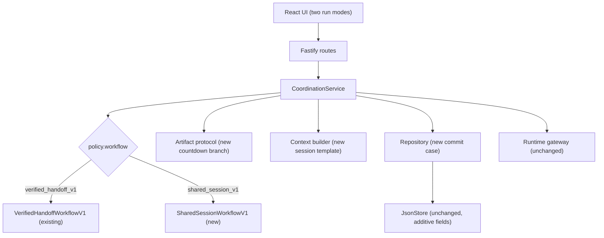

# Relay Sessions: Shared-Session Workflow Contract

**Status:** Approved via team mini-RFC on 2026-08-30. The free-chat completion signal (`done`) was confirmed by the whole team on 2026-08-30; it is no longer provisional.
**Authority:** This file is the repository-local contract authority for the `shared_session_v1` workflow. [`overview.md`](./overview.md) remains the sole authority for the existing `verified_handoff_v1` workflow and for every shared engine semantic (trust boundary, atomic mutation rules, orchestration loop, parsing order, redaction).
**Numbering:** The implementation plan now has nine phases. Phases 0–4 (existing) are complete. Phases 5–8 build the session workflow. Phase 9 is the renumbered release phase (previously Phase 5; its task IDs moved from P5-xx to P9-xx).

---

## 1. Why this exists

The problem statement's multi-agent coordination example requires: several Agents counting down from 10 to 1 in a shared conversation, one number per turn, in turn order, with a visible history of which Agent produced each number, and timeout/retry/stop rules. The verified handoff pipeline cannot demonstrate this because its Agents exchange typed review documents, not a shared conversation.

The minimum coordination layer and how Relay Sessions meets it:

| Minimum requirement | Relay Sessions feature |
|---|---|
| Shared session all Agents can read and write | The session is the committed message log. Every turn's prompt contains the full transcript. Agents write by publishing a validated message. |
| Turn-selection or routing rule | Round-robin over an ordered participant list: next Agent = `participants[committedSessionTurns % N]`. |
| Shared state preventing duplicate or skipped turns | `run.sharedState.nextExpectedNumber` plus a validator that accepts only the exact expected integer. Duplicate and stale prevention reuses the existing lease and version machinery unchanged. |
| Visible event history showing who produced each number | The existing event ledger and evidence timeline, plus a chat-like transcript view in the web app. |
| Timeout, retry, stop | The existing runtime gateway, reservation system, stop flow, and late-result fencing. Reused 100%. |

The verified handoff workflow remains a second workflow on the same engine. Nothing is removed.

## 2. Scope and non-goals

**Build:**

- A `shared_session_v1` workflow with 2 to 6 distinct pre-created Agents as ordered participants.
- Round-robin turn selection owned by backend code.
- Two session protocols on the same engine:
  - `countdown`: each message must be exactly the expected next integer (the headline acceptance demo).
  - `free_chat`: any bounded, non-empty message; the run completes when every participant's latest message carries `done: true`, or at `maxTurns`, or on user stop (general task collaboration).
- `run.sharedState.nextExpectedNumber` as the durable shared state for countdown runs.
- A transcript-building context template that includes all committed session messages in order.
- The web form mode, transcript view, and session timeline labels.

**Non-goals (explicit cut unless the team approves otherwise):**

- Semantic evaluation of free-chat content: the middleware guarantees mechanics and never judges substance; it only reads the advisory `done` signal.
- Turn reassignment to another participant after retry exhaustion.
- Parallel fan-out turns.
- Dynamic Agent creation or participant changes after start.
- Any change to verified-handoff semantics, routes, or stored shapes.

## 3. Architecture delta

Everything described in `overview.md` Section 5 remains. The session workflow touches only these seams:



Untouched: lease and version semantics, atomic mutation structure, event numbering, redaction, reservation rules, `AgentService.startExecution`, the runtime gateway with timeout and cancellation, polling and stop UX, and every verified-handoff behavior.

## 4. Domain model (additive)

All changes are additive. Existing databases load unchanged. No migration.

```ts
// additions to apps/server/src/coordination/types.ts
export type CoordinationRole =
  | "planner" | "critic" | "finalizer"
  | "participant";                                   // session turns

export type CoordinationPhase =
  | "drafting" | "reviewing" | "revising" | "finalizing"
  | "sessioning"                                     // session runs
  | "done";

export type CoordinationTurnKind =
  | "initial_proposal" | "proposal_revision" | "proposal_review" | "finalization"
  | "session_turn";

export type ArtifactType =
  | "proposal" | "review" | "final"
  | "session_message";

export type CoordinationWorkflowKind =
  | "verified_handoff_v1"
  | "shared_session_v1";

export interface SessionMessagePayload {
  schemaVersion: 1;
  type: "session_message";
  content: string;        // the published message; trimmed, 1..500 chars (countdown adds the integer rule)
  done?: boolean;         // free-chat only: advisory completion signal (Section 6.5); rejected on countdown
}

export interface CoordinationPolicy {
  workflow: CoordinationWorkflowKind;   // was a literal; becomes a discriminated field
  maxRevisions: number;                 // ignored by session workflow
  maxTurns: number;                     // session: must be >= sessionStartValue
  maxAttemptsPerTurn: number;           // unchanged
  perAttemptTimeoutMs: number;          // unchanged
  contextMaxChars: number;              // unchanged
  outputMaxChars: number;               // unchanged
  sessionStartValue?: number;           // countdown only; default 10; range 2..12
  sessionProtocol?: "countdown" | "free_chat"; // session only; default "countdown"
}

export interface CoordinationRun {
  // existing fields unchanged; add:
  sharedState?: {
    nextExpectedNumber?: number;        // session only; present while the run is active
  };
}
```

Session participants are stored in the existing `participants` array as ordered `{ role: "participant", agentId, agentNameSnapshot }` entries, 2 to 6 of them, all distinct. No new participant table.

### 4.1 Session message payload

```ts
{ schemaVersion: 1, type: "session_message", content: string /* 1..500 */, done?: boolean }
```

`content` is the participant's message: the exact next integer for countdown, any
bounded non-empty text for free chat. `done` is the free-chat completion signal
described in Section 6.5; it is absent on countdown messages and rejected if
present.

## 5. Workflow semantics

`SharedSessionWorkflowV1` (new file `coordination/session-workflow.ts`) is pure and deterministic, mirroring `overview.md` Section 11.1:

| Durable state | Next decision |
|---|---|
| New running session run | Schedule `session_turn` for `participants[committedSessionTurnCount % participantCount]`, phase `sessioning`, expected artifact `session_message` |
| Countdown: latest committed message has value `n`, `n > 1` | Schedule the next round-robin participant |
| Countdown: latest committed message has value `1` | Complete with the final artifact |
| Free chat: every participant's most recent committed message carries `done: true` | Complete with the final artifact |
| Free chat: not all participants have signalled `done`, and `nextTurnSequence <= maxTurns` | Schedule the next round-robin participant |
| Scheduling would exceed `maxTurns` | Countdown fails `MAX_TURNS_EXCEEDED`; free chat completes |
| Missing or inconsistent `sharedState` (countdown), or non-session artifacts in a session run | Fail `INVALID_STATE` safely |

- `inputArtifactIds` on a session turn lists every committed `session_message` in the run so far, in chronological order. This is the transcript.
- Retries do not change the round-robin position: the position derives from committed session turns only.
- The `revision` field stays 0 for session runs.
- On any session completion, the run's `finalArtifactId` points at the last committed session message. For countdown that is the message with value `1`; for free chat it is the closing message of the unanimous round, or the message that consumed `maxTurns`.

## 6. Countdown protocol

### 6.1 Validation order (reuses overview.md Section 11.4)

1. Reject output above `outputMaxChars`.
2. Trim whitespace.
3. Strip at most one outer Markdown JSON fence.
4. `JSON.parse` exactly once; no extraction from prose.
5. Strict schema: `{ schemaVersion: 1, type: "session_message", content: string 1..500 }`.
6. Cross-field rule: `content` must parse as an integer equal to `run.sharedState.nextExpectedNumber`. Otherwise fail with `INVALID_AGENT_OUTPUT` and a retry-safe message: `Expected the next number <N>, received <X>`.
7. Backend constructs provenance; Agent-supplied IDs are ignored, as today.

### 6.2 Commit rule

On accepting a session message with value `n`, the repository atomically sets `run.sharedState.nextExpectedNumber = n - 1` in the same store mutation that settles the turn and attempt, stores the immutable artifact, updates pointers, increments the version, and appends events. When `n === 1`, the next workflow decision completes the run. The versioned run plus the committed artifact list is the shared state; there is no separate state table.

### 6.3 Prompt rules (the honest demo boundary)

The session turn prompt contains the existing four-section envelope adapted for the session role:

- The `[RELAY SYSTEM CONTRACT]` header.
- `[COMMITTED INPUT ARTIFACTS]` rendered as the chronological transcript, each line `<AgentName>: <content>`, bounded by `contextMaxChars` using the existing deterministic truncation ladder (oldest entries truncated first, with the existing marker).
- `[YOUR TASK]`: continue the countdown by publishing the next number, exactly one lower than the last number in the transcript, as the Agent's only message.
- `[OUTPUT CONTRACT]` for `session_message`.

**The prompt must never state the expected number.** The Agent reads the shared transcript and derives it. The validator, not the prompt, is the authority. This is what makes the live wrong-number failure demo possible and keeps the middleware responsible for correctness.

### 6.4 Retry and failure

A wrong or malformed number follows the existing attempt algorithm unchanged: retry once on the same Agent with the validation errors, then fail the run with `MAX_ATTEMPTS_EXCEEDED`. Turn reassignment to another participant is explicit non-goal scope.

### 6.5 Free-chat protocol

- **Validation:** the same parsing order as 6.1 steps 1 to 5 (size, trim, one outer fence, one parse, strict schema with content 1..500). There is no cross-field numeric rule.
- **Shared state:** free-chat runs have no `nextExpectedNumber`; `run.sharedState` stays absent.
- **Prompt:** `[YOUR TASK]` instructs the Agent to contribute the next message toward the shared objective based on the transcript. The output contract is the same `session_message` shape. No expected value exists to state, so the countdown prompt rule has no free-chat equivalent.
- **Completion:** the workflow completes when **every participant's most recent committed message carries `done: true`** (unanimous consent across one full round), or when all allowed turns are committed (`maxTurns`), or on user stop -- whichever comes first. The middleware coordinates turns and guarantees mechanics; it never judges message *substance*, only whether the participants have all said they are finished. On completion, the run's `finalArtifactId` points at the last committed session message.
- **The `done` signal:** `SessionMessagePayload.done` is an optional boolean, free-chat only. It is advisory. An Agent may declare that it considers the shared objective met; an Agent never ends a run. The completion rule is evaluated by backend code over committed artifacts, so Section 5.1's trust boundary is unchanged and one participant cannot truncate the collaboration. A later message from the same participant that omits the flag clears that participant's own signal. With no signals at all, behaviour is exactly the frozen `maxTurns` rule, so the addition is strictly additive. Unanimity needs at least one message from every participant, so a run cannot complete before `participantCount` committed turns. `done` is rejected on a countdown message, where the numeric validator is the sole authority.
- **Retry and failure:** the attempt algorithm is identical (malformed or timed-out output retries once, then the run fails).

## 7. API changes

The create body becomes a union on `workflow`. `workflow` is optional and defaults to `"verified_handoff_v1"`, so existing clients keep working. All routes and statuses otherwise unchanged.

```json
{
  "workflow": "shared_session_v1",
  "name": "Countdown session",
  "objective": "Count down from 10 to 1 together",
  "agents": ["<id1>", "<id2>", "<id3>"],
  "policy": { "sessionStartValue": 10, "maxTurns": 10, "perAttemptTimeoutMs": 120000 }
}
```

| Rule | Error |
|---|---|
| `agents` ordered array, 2..6, distinct | 400 |
| Every Agent exists | 404 |
| Every Agent is ready at start (existing start-time checks apply) | 409 |
| `sessionProtocol` is `"countdown"` (default) or `"free_chat"` | 400 otherwise |
| Countdown: `sessionStartValue` integer 2..12 (required or defaulted); free chat: `sessionStartValue` forbidden | 400 |
| Countdown: `maxTurns >= sessionStartValue`; free chat: `maxTurns` 3..12 (default 6) | 400 |
| `requiredSections` absent or empty for session runs | 400 |
| `maxRevisions` not accepted on session runs | 400 |

Free-chat variant:

```json
{
  "workflow": "shared_session_v1",
  "name": "Research brainstorm",
  "objective": "Propose and refine a three-point launch plan for the marketplace",
  "agents": ["<id1>", "<id2>", "<id3>"],
  "policy": { "sessionProtocol": "free_chat", "maxTurns": 6, "perAttemptTimeoutMs": 120000 }
}
```

For countdown runs, `run.sharedState` is part of the public read model and the UI renders it. Leases and internal capability fields remain hidden, as today.

## 8. Repository rules

- Every session commit runs in exactly one `JsonStore.mutate()` with the unchanged lease and version checks (`overview.md` Section 10.3).
- `expectedArtifactTypeForTurn` gains a `session_turn` case returning `"session_message"`.
- No new database collections. `sharedState` is an optional run field, so the database shape stays version 2.
- Reservation is already derived from participants of non-terminal runs (`overview.md` Section 10.4); session runs inherit it with no change.
- Restart interruption (`overview.md` Section 10.5) settles active session runs exactly like verified runs.

## 9. Test matrix (new tests only)

| Layer | Cases |
|---|---|
| Session workflow (pure) | Round-robin order over 2, 3, 4 Agents; countdown completion at 1; free-chat completion on a unanimous `done` round; partial `done` does not complete; a withdrawn signal reopens the run; no signals still completes at `maxTurns`; `MAX_TURNS_EXCEEDED`; malformed `sharedState`; deterministic selection; dispatcher selects by workflow id |
| Countdown protocol | Valid number; wrong number; non-integer content; oversize; fenced JSON; prose; missing fields; forged provenance; unknown fields |
| Free-chat protocol | Valid free text; `done: true` accepted; non-boolean `done` rejected; `done` on a countdown message rejected; empty content rejected; oversize rejected; fenced JSON; prose; forged provenance |
| Context builder | Transcript ordering; truncation of oldest first; expected number never appears in a countdown prompt; no lease, token, or event leakage; stable digest |
| Repository | Commit decrements `nextExpectedNumber`; wrong lease stale; duplicate commit prevention; stop-versus-commit race; restart interruption for session runs |
| Service | Normal 10-to-1; wrong number retry then success; wrong twice then fail; timeout retry; stop; late result; create validation (count, duplicates, ranges, sections rejected) |
| API | Session create 201, validation 400s, missing Agent 404, reservation 409, auth required |
| Web | Form validation, transcript rendering, terminal states, polling continues to work |

All existing 389 tests must remain green throughout.

## 10. Demo plan

- **Primary live path:** create three or four fresh Agents, start a 10-to-1 session, watch the transcript fill with `<AgentName>: 10`, then 9, then 8, in round-robin order, with the evidence timeline beside it. Show `sharedState.nextExpectedNumber` decrementing.
- **General task evidence:** after the countdown, show one short free-chat session (4 to 6 turns) where the same engine coordinates Agents on an open topic and completes when the Agents unanimously signal `done`, or at the turn limit. This proves the machinery is task-agnostic.
- **Failure path (live, honest):** one demo Agent is created with a base instruction that occasionally subtracts two instead of one. When it publishes the wrong number, the middleware rejects it, shows the validation error, retries, and the run continues. The Agent genuinely misbehaved; the middleware genuinely caught it. Do not simulate middleware behaviour.
- **Latency mitigation:** per-turn times measured so far are 13 to 60 seconds, so a live 10-turn run is 2.5 to 10 minutes, over the 3-minute demo budget. Mitigations in order: create demo Agents on the fastest available model endpoint; pre-execute a full 10-to-1 run so the evidence view is already populated; start a live shorter run (5-to-1) and narrate architecture while it polls; keep one stored wrong-number run for the failure evidence.
- **Housekeeping:** the current "Test Relay" run whose objective was "Count down from 10 to 0" produced a final artifact claiming a countdown was executed when nothing was executed. Delete that run from `data/launchpad.json` before judging (Phase 9 task P9-19) or it becomes confusing evidence.

## 11. Settled decisions and defaults

All of these were open questions until P5-01. The team settled every one on
2026-08-30; full rationale is in
[`ASSUMPTIONS_AND_DECISIONS.md`](./ASSUMPTIONS_AND_DECISIONS.md). Changing any of
them now requires a mini-RFC.

| Question | Settled |
|---|---|
| `sessionStartValue` default and range | 10; range 2..12 (countdown only) |
| `workflow` field defaulting vs breaking change | Optional, defaults to `verified_handoff_v1` |
| Participant ordering UX | Selection order is the turn order; drag reordering is stretch |
| Wrong-number recovery | Retry same Agent, then fail run; reassignment is cut |
| Free-chat default `maxTurns` | 6; range 3..12 |
| Free-chat completion | Unanimous `done` across one round, or `maxTurns`, or user stop (team-confirmed 2026-08-30) |
| Free-chat final artifact pointer | The last committed session message |
| Delete the misleading countdown run from `data/` | Yes, before submission (P9-19) |

The unanimity rule was proposed by the Phase 5 implementer and confirmed by
the whole team on 2026-08-30, together with the final-artifact-pointer rule
above. Both are now settled; P6-01 encodes them.

## 12. Relation to existing documents

- `overview.md` Sections 5.1 (trust boundary), 10.3 (atomic mutation rules), 10.4 (reservation), 10.5 (restart), 11.2 (orchestration loop), 11.3 (attempt algorithm), 11.4 (parsing order) apply unchanged to session runs.
- `overview.md` Sections 7–8 remain the frozen contract for the verified workflow only; session additions in this file are additive on top of them.
- Phase sheets: `phases/05-session-contracts.md`, `06-session-core.md`, `07-session-durable.md`, `08-session-ui.md`, and `09-release.md`.
