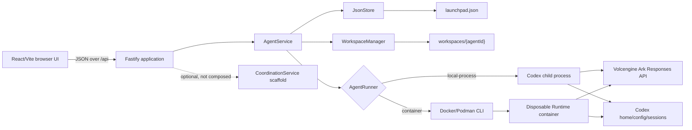
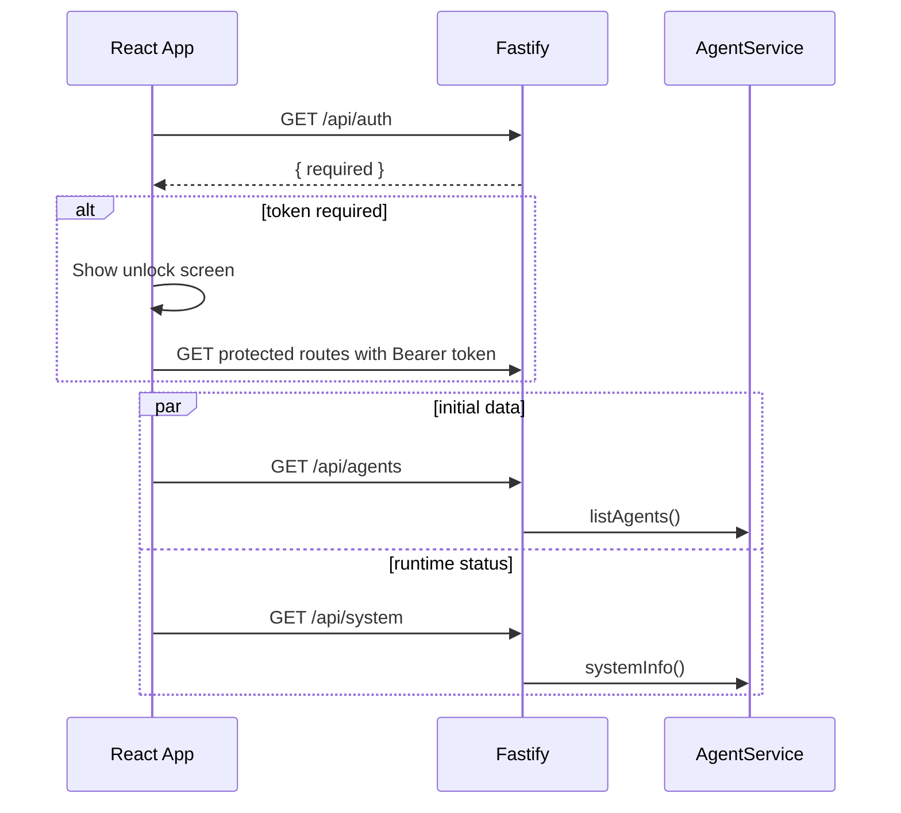
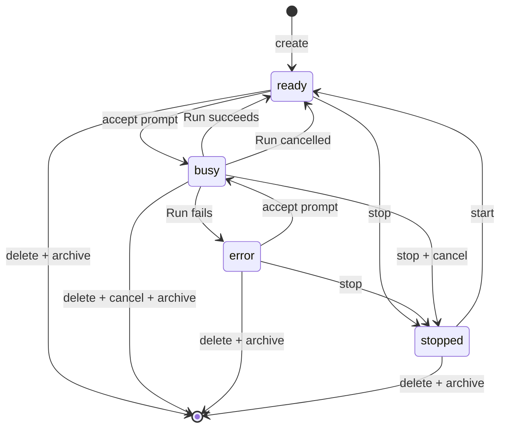

# Architecture and runtime flows

## Component view



The browser never receives `ARK_API_KEY`. It receives only the non-secret
runtime status returned by `/api/system`. The server passes the Ark key to a
Codex child environment or to the container engine through environment
inheritance.

## Startup flow

The server composition root is `apps/server/src/index.ts`:

1. `loadConfig()` parses and validates environment variables with Zod and
   resolves runtime paths to absolute paths.
2. `writeCodexConfig()` generates `<CODEX_HOME>/config.toml` for the Volcengine
   Ark Responses provider.
3. The process constructs `JsonStore`, `WorkspaceManager`, and the selected
   `AgentRunner` through `createRunner()`.
4. `AgentService.initialize()` initializes storage/workspaces and repairs state
   left by a previous server exit.
5. `createApp()` creates Fastify, installs CORS/authentication/routes/error
   handling, and serves the built React app in production.
6. Fastify listens on the configured host and port. `SIGINT` and `SIGTERM`
   close Fastify and exit the process.

Restart recovery changes any persisted `queued` or `running` Agent Run to
`cancelled` with the message “Server restarted while this run was active.” Any
Agent persisted as `busy` is returned to `ready`. The current shutdown handler
does not explicitly cancel active runners before exiting, so recovery is based
on persisted state when the process starts again.

## Browser bootstrap and authentication



The browser holds the shared token only in the module-scoped variable in
`apps/web/src/api.ts`; it is not persisted to local storage. A refresh requires
unlocking again. When `APP_AUTH_TOKEN` is empty, all API routes are open. When
it is set, `/api/health` and `/api/auth` remain public and every other `/api/`
route requires an exact bearer token match.

## Agent creation and update

Creating an Agent:

1. The API validates name, description, and instructions.
2. `AgentService` creates a UUID and a `ready` Agent record.
3. `WorkspaceManager.create()` creates `<workspaceRoot>/<agentId>` without
   allowing an existing directory, then writes:
   - `AGENTS.md` with Agent identity, custom instructions, and fixed workspace
     safety rules;
   - `.gitignore` for common generated/secret files;
   - a short workspace `README.md`.
4. The Agent is appended to the JSON database.

Updating an Agent mutates metadata first and then regenerates `AGENTS.md`.
Updates are rejected while the Agent is `busy`. A failure writing the updated
instructions after persistence can therefore leave stored settings newer than
the workspace file; there is no rollback transaction across both resources.

## Message and Run execution

```mermaid
sequenceDiagram
    participant UI as React App
    participant API as Fastify
    participant S as AgentService
    participant DB as JsonStore
    participant R as AgentRunner
    participant C as Codex
    UI->>API: POST /api/agents/{id}/messages
    API->>S: sendMessage(agentId, prompt)
    S->>DB: Atomically append queued Run + user Message; mark Agent busy
    S-->>API: Run and Message
    API-->>UI: 202 Accepted
    S->>DB: Mark Run running
    S->>R: run(workspace, prompt, stored thread ID)
    R->>C: codex exec --json ... [resume]
    C-->>R: newline-delimited JSON events
    R-->>S: final output, thread ID, usage
    S->>DB: Complete Run, append assistant Message, mark Agent ready
    loop about every 900 ms
        UI->>API: GET /api/runs/{runId}
        API-->>UI: current Run
    end
    UI->>API: GET messages and agents after terminal status
```

`sendMessage()` returns before Codex completes. Admission and state changes are
performed inside one serialized `JsonStore.mutate()` call, so two concurrent
prompts for the same Agent cannot both pass the `busy` check. The in-memory
`activeExecutions` map tracks background completion, and the runner also
rejects a second active process/container for the same Agent.

On success, only the last completed `agent_message` event becomes the assistant
message. The stored Codex thread ID is updated and used with `codex exec resume`
on later turns. Token usage is copied from the `turn.completed` event when
present.

On failure, the Run becomes `failed`, the Agent becomes `error`, and
`lastError` is populated. On explicit cancellation, the Run becomes
`cancelled`; the Agent normally returns to `ready`, unless it has already been
set to `stopped`. Failed/cancelled Runs do not append assistant messages.

## Lifecycle behavior



An Agent in `error` is still allowed to accept a new prompt; the admission
logic rejects only `stopped` and `busy`. Starting is effectively a reset to
`ready`, but it is rejected for a `busy` Agent. Stopping waits for runner
cancellation and background execution settlement before persisting `stopped`.
Deleting first cancels execution, then archives the workspace, then removes all
Agent, message, and Run records.

## Runtime-provider boundary

Both runners implement `AgentRunner`:

```ts
run(request): Promise<{ output; threadId; usage }>
cancel(agentId): Promise<boolean>
isAvailable(): Promise<boolean>
```

They share argument generation and event parsing. Common behavior includes:

- argv-based child creation (no shell interpolation);
- `codex exec --json --sandbox <mode> --skip-git-repo-check -C <workspace>`;
- session resume when a thread ID exists;
- total stdout/stderr byte limiting;
- timeout and cancellation;
- bounded retained stderr (last 16 KiB);
- extraction of thread, assistant message, usage, and Codex error events.

The local-process runner sends `SIGTERM`, then `SIGKILL` after three seconds.
The container runner calls `<engine> rm --force <containerName>` and falls back
to process termination if removal fails.

## Production versus development serving

- Development: Vite serves the web UI on port 5173 and proxies `/api` to
  `127.0.0.1:3001`; Fastify permits CORS only from the two local Vite origins.
- Production: the web build is emitted to `apps/web/dist`; Fastify static
  serving resolves that directory relative to compiled `apps/server/dist`.
  Unknown non-API paths return `index.html` for client-side navigation, while
  unknown API paths return JSON 404.
