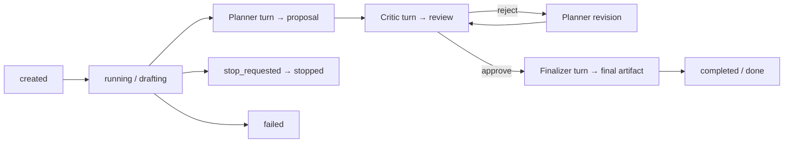

# Coordination scaffold

## Status: implemented contracts and orchestrator, not a live feature

`apps/server/src/coordination/` introduces a verified multi-Agent handoff
domain. It is newer than the baseline and deliberately decomposed behind
interfaces, but only part of the intended feature exists.

Implemented:

- domain types, policies, artifacts, event types, and error codes;
- dependency contracts for persistence, workflow, context, validation, runtime,
  clock, IDs, and Agent lookup;
- an asynchronous `CoordinationService` orchestration loop;
- request validation and optional Fastify routes;
- unit tests using in-memory/scripted dependency fakes.

Missing from production composition:

- concrete `CoordinationRepository` and database-v2/migration support;
- concrete verified-handoff workflow decision logic;
- concrete role-scoped context builder;
- concrete artifact parser/validator;
- concrete runtime adapter connected to `AgentService`/`AgentRunner`;
- concrete ID and clock adapters (outside test fakes);
- reservation enforcement that stops participating Agents being used elsewhere;
- construction/initialization in `apps/server/src/index.ts`;
- passing the service into `createApp(config, agentService, coordination)`;
- web types, API methods, create/detail/timeline/artifact views.

Consequently, `/api/coordination-runs` returns the normal API 404 in the shipped
application even though route tests pass by manually injecting a fake service.

The untracked `docs/development/overview.md` in this workspace is a detailed
future design/implementation plan for “Relay: Verified Multi-Agent Handoffs.”
It is planning material, not evidence that its described components are live.

## Intended domain

A coordination run assigns three distinct existing Agents:

- **Planner** produces a proposal.
- **Critic** reviews the proposal and approves/rejects it.
- **Finalizer** produces the final result after an accepted handoff.

The type system also supports proposal revision. Runs advance through
`drafting`, `reviewing`, `revising`, `finalizing`, and `done` phases. The
workflow contract, not `CoordinationService`, decides which role/turn comes
next.



## State hierarchy

```text
CoordinationRun
├── participants[planner, critic, finalizer] with name snapshots
├── policy and required sections
├── phase/status/revision/version pointers
├── CoordinationTurn[]
│   └── CoordinationAttempt[]
├── CoordinationArtifact[]
└── CoordinationEvent[]
```

- A **turn** is one logical role assignment, such as initial proposal or review.
- An **attempt** is one runtime try for that logical turn. Invalid output and
  runtime failure can be retried without creating a new turn.
- A **lease token** ties late runtime completion to the active attempt and lets
  a repository reject stale results.
- An **artifact** is a validated proposal, review, or final payload.
- An **event** is intended safe evidence of lifecycle transitions. Event types
  are declared, but the current service delegates all event creation to the
  missing repository implementation.

## Default policy

| Setting | Default | Purpose |
| --- | ---: | --- |
| Workflow | `verified_handoff_v1` | Stable workflow identity. |
| Max revisions | 2 | Bounds review/revision cycles. |
| Max turns | 8 | Bounds logical orchestration work. |
| Attempts per turn | 2 | Bounds output/runtime retries. |
| Attempt timeout | 120,000 ms | Bounds one Agent invocation. |
| Context maximum | 12,000 characters | Intended prompt-context cap. |
| Output maximum | 20,000 characters | Intended artifact-output cap. |

The route permits callers to override revisions (0–3), turns (3–12), and
attempt timeout (10–180 seconds). Attempts/context/output limits remain fixed
by the default policy in `createRun()`.

## Service orchestration

`CoordinationService` is dependency-injected and owns only lifecycle routing:

1. `initialize()` asks the repository to interrupt previously active runs.
2. `createRun()` validates distinct Agents/section keys, looks up selected
   Agents, snapshots their names, merges policy overrides, and persists a
   `created` run.
3. `startRun()` delegates the atomic start transition to the repository, then
   launches one in-memory background loop per coordination-run ID.
4. The loop reloads durable details and asks `VerifiedHandoffWorkflow` for a
   schedule, complete, or fail decision.
5. Scheduling is optimistic: the repository receives `expectedRunVersion` and
   may return `stale`, causing the loop to reload.
6. The service builds a prompt, creates an attempt with a lease token, starts
   runtime execution, and attaches the returned baseline Agent Run ID.
7. Successful raw output is passed to `ArtifactProtocol`. Valid artifacts are
   committed with attempt ID + lease; invalid output records validation errors
   and retries the same turn.
8. Exhausted attempts fail the coordination run. Timeout/failure/cancellation
   receive distinct attempt states/codes.
9. `stopRun()` durably requests stop, attempts runtime cancellation, and then
   settles the run as stopped even if gateway cancellation throws.

Unexpected loop errors are logged without raw exception content through the
minimal logger contract, and the repository is asked to fail the run with a
generic internal-error message.

## Contract boundaries

| Interface | Future implementation responsibility |
| --- | --- |
| `CoordinationAgentDirectory` | Load Agent identity/status; eventually enforce readiness/reservation. |
| `CoordinationRepository` | All durable atomic transitions, events, version/lease checks, restart repair. |
| `VerifiedHandoffWorkflow` | Pure next-turn/revision/limit decision logic. |
| `ContextBuilder` | Build bounded role-specific prompts from selected artifacts and retry feedback. |
| `ArtifactProtocol` | Parse and strictly validate role output; enforce output limit. |
| `CoordinationRuntime` | Start/cancel real Agent attempts and normalize outcomes. |
| `Clock` / `IdGenerator` | Deterministic/testable timestamps, IDs, event IDs, and lease tokens. |

These boundaries are useful extension seams. Avoid putting storage mutations or
output parsing directly into `CoordinationService`; doing so would bypass the
stale-result and testability design.

## Existing tests and what they prove

`service.test.ts` provides test-only in-memory implementations and verifies:

- selected Agent name snapshots and duplicate-ID rejection;
- Planner → Critic → Finalizer background sequencing;
- invalid output retry on the same Planner turn with retry feedback;
- stop settlement and prevention of a second local orchestration loop.

`routes.test.ts` manually injects a fake coordination contract and verifies:

- shared bearer authentication applies to coordination routes;
- strict structured request validation;
- create/start/events response shapes and status codes.

They do not prove durable storage, restart recovery, real Agent execution,
production route registration, or browser behavior.

## Integration order for future work

The safest dependency order is:

1. implement/migrate durable storage and repository transition tests;
2. implement pure workflow, artifact validation, and context builder;
3. implement the runtime bridge with cancellation/timeout tests;
4. construct adapters and call `coordination.initialize()` in `index.ts`;
5. pass the service to `createApp` and add an application-composition test;
6. extend the web API error parser/types/client and add coordination views;
7. add a real end-to-end happy path, invalid-output path, stop path, and restart
   test.

Until those steps are complete, keep documentation and demos explicit that the
coordination layer is scaffolding.
